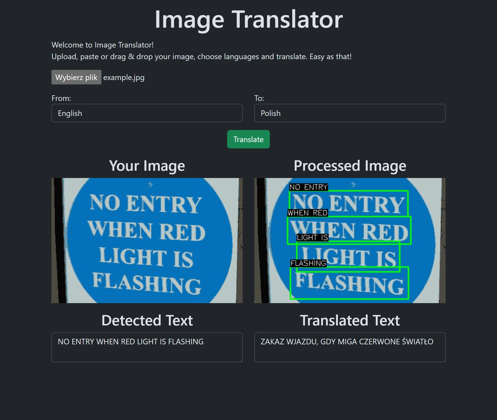

# Image-Translator

### About The Project

Image Translator is a web application that allows users to upload images containing text and translate that text into different languages. The application utilises optical character recognition (OCR) to detect text in the uploaded images, OpenCV to process the image and then uses DeepL API to translate the detected text.


### Built With

- 
- 
- 
- EasyOCR
- DeepL API

### Getting Started

To get a local copy up and running, follow these simple steps:

1. Clone the repo
   ```sh
   git clone https://github.com/fsosn/Image-Translator.git
   ```
2. Install the dependencies
   ```sh
   cd frontend
   npm install
   ```
   ```sh
   cd backend
   pip install -r requirements.txt
   ```
3. Set up environment variables

   1. Create a `.env` file in the backend directory
   2. Generate API key at [DeepL](https://www.deepl.com/pro-api)
   3. Add your DeepL API key to the `.env` file in the following format:
      ```plaintext
      DEEPL_AUTH_KEY=your_deepl_api_key
      ```
   4. Save the `.env` file

4. Start the backend
   ```sh
   flask run
   ```
5. Start the frontend
   ```sh
   npm run dev
   ```

### Usage

1. Upload, paste or drag and drop an image containing text.
2. Select the source and target languages.
3. Click the "Translate" button to process the image and translate detected text.



